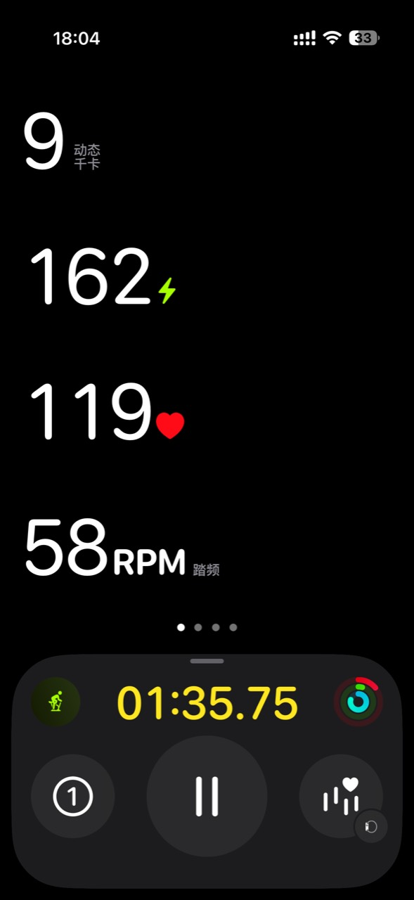
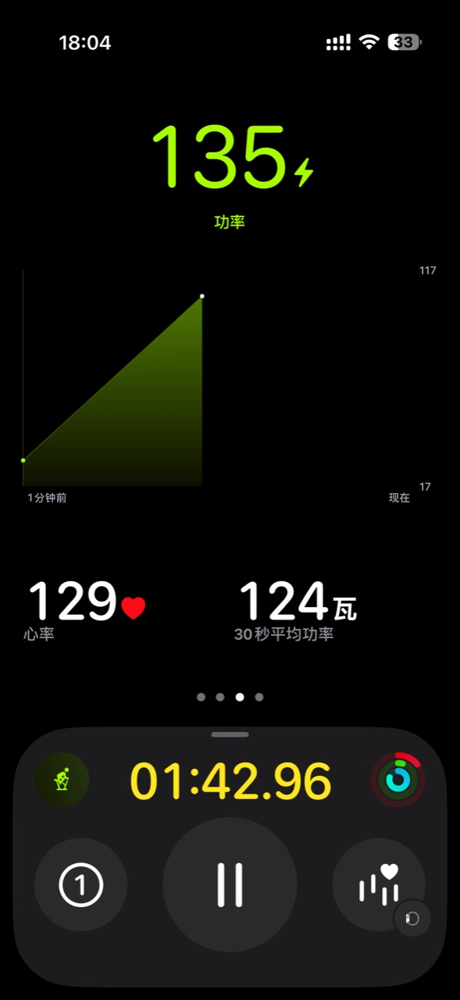
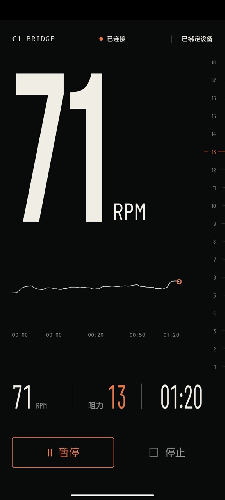
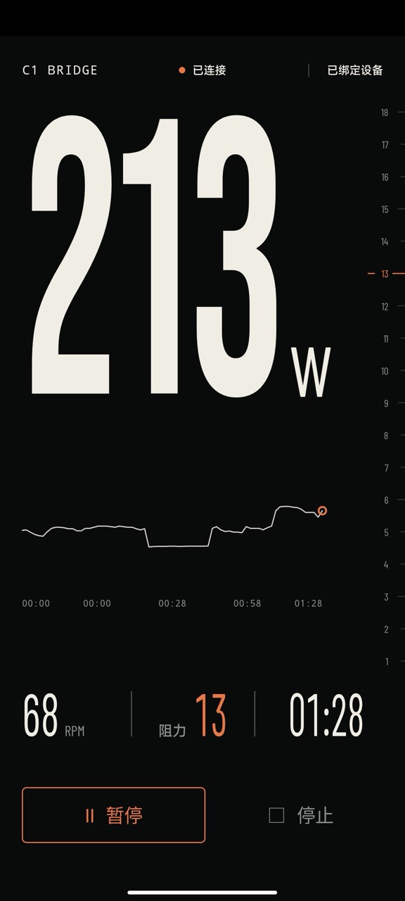
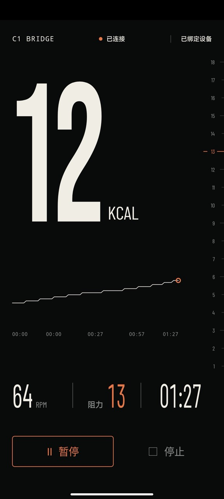
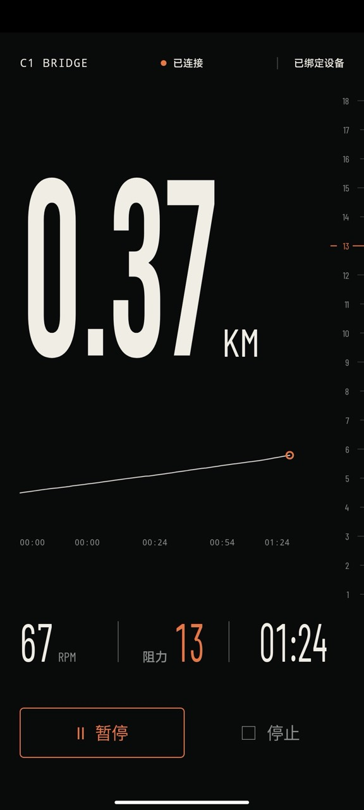

# Keep 2 Fitness

把 Keep C1 Mini 的骑行数据连接到 Apple Watch 上。

单车本身能提供踏频、功率、阻力等数据。本项目将这些数据转换成 Apple Watch 可识别的标准蓝牙骑行功率计数据，在 Apple Fitness+ 和手表上可以直接查看踏频与功率。

  
  

## 实现方式

Keep 2 Fitness 会连接 C1 Mini，再通过 Android 手机或 ESP32 向 Apple Watch 提供标准的蓝牙骑行功率计服务。

Apple Watch 在“设置 → 蓝牙 → 健康设备”中搜索并连接后，可以在训练中看到功率和踏频。Android 手机和 ESP32 均包含独立仪表盘，可以显示阻力、时间、距离、热量和实时曲线。

项目提供两种用法：Android 版适合直接拿一台手机使用，ESP32 版适合长期放在单车旁边。

## 可用功能

### 监听模式

无需绑定设备，自动连接附近第一台 C1 Mini，可查看踏频、功率、阻力、时间、距离、热量和实时曲线，也可以向 Apple Watch 提供踏频与功率数据。

### 控制模式

扫描单车二维码或输入完整 SN 后，可以调节阻力，并使用开始、暂停、继续和停止训练控制。

## Android 版

准备一台 Android 8.0 或更高版本的设备，从 Releases 下载 APK 并安装。

第一次打开时，按系统提示允许“附近的设备”和相机权限。应用会搜索身边的 C1 Mini：

1. 只想连接 Apple Watch 查看数据，无需设置设备，保持监听模式即可。
2. 需要调节阻力、使用训练控制和查看完整数据时，点击“添加设备”，扫描单车屏幕上的 App 连接二维码。
3. 二维码不方便扫描时，也可以手动输入扫描结果里的 16 位完整 SN。
4. 在 Apple Watch 的“设置 → 蓝牙 → 健康设备”中搜索并连接 `C1 Bridge`；Android 版也可能显示为手机名称。
5. 打开 Apple Fitness+ 的室内单车训练，就可以在手表上看到踏频和功率。

点击主数字可以在踏频、功率、热量、距离和骑行时间之间切换。阻力刻度在右侧，长按阻力区域并上下拖动即可调节阻力。

  
  
  
  

## ESP32 版

使用 ESP32-S3 开发板：

- ESP32-S3FH4R2
- 4 MB Flash
- 2 MB PSRAM

从 Releases 下载对应的 ESP32 固件，通过 USB Type-C 刷入开发板。

通电后，ESP32 会自动搜索附近的 C1 Mini，并以监听模式运行。在 Apple Watch 的“设置 → 蓝牙 → 健康设备”中搜索并连接 `C1 Bridge` 即可。

需要使用网页仪表盘、绑定单车、调节阻力或配置局域网 API 时：

1. 手机连接名为 `C1-Bridge-XXXX` 的 Wi-Fi。
2. 浏览器打开 `http://192.168.4.1/`。
3. 在设备设置中选择家里的 2.4 GHz Wi-Fi 并输入密码。
4. 扫描单车二维码、拍摄二维码照片，或者展开手动输入并填写完整 SN。

配网完成后，可以通过 `http://c1bridge.local/` 或路由器分配的局域网地址打开仪表盘。ESP32 会在单车唤醒后连接设备，并持续向 Apple Watch 提供标准骑行功率计数据。

网页提供局域网 API，默认可以直接使用，也可以在设置中启用密钥验证，方便接入家庭自动化或其他本地服务。

## AI 声明

本项目绝大多数代码由 AI 生成。请自行判断风险并在使用前审查代码，DYOR。

## 赞赏支持

如果这个项目对你有帮助，可以通过 Star、Issue、建议反馈或赞赏支持继续维护。

  

## 许可证

本项目采用 [MIT License](LICENSE) 开源。保留版权与许可声明后，可以自由使用、修改、分发或用于商业项目。
